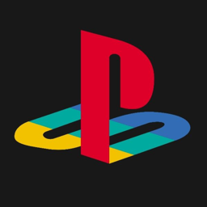
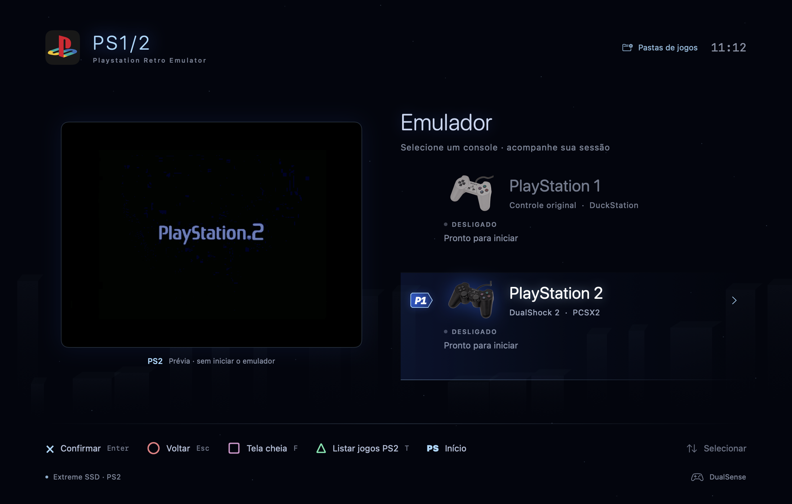
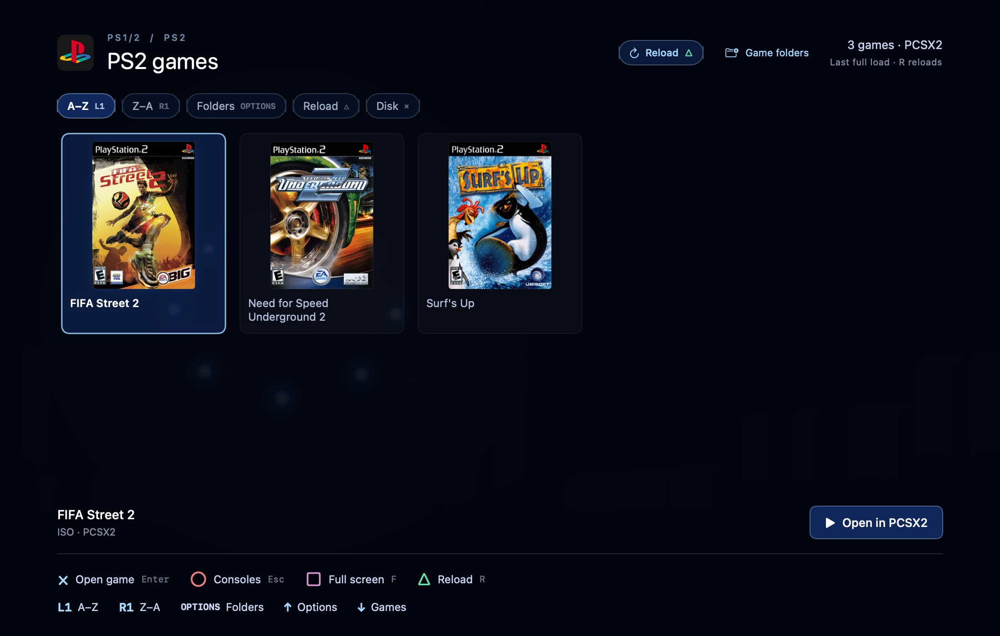
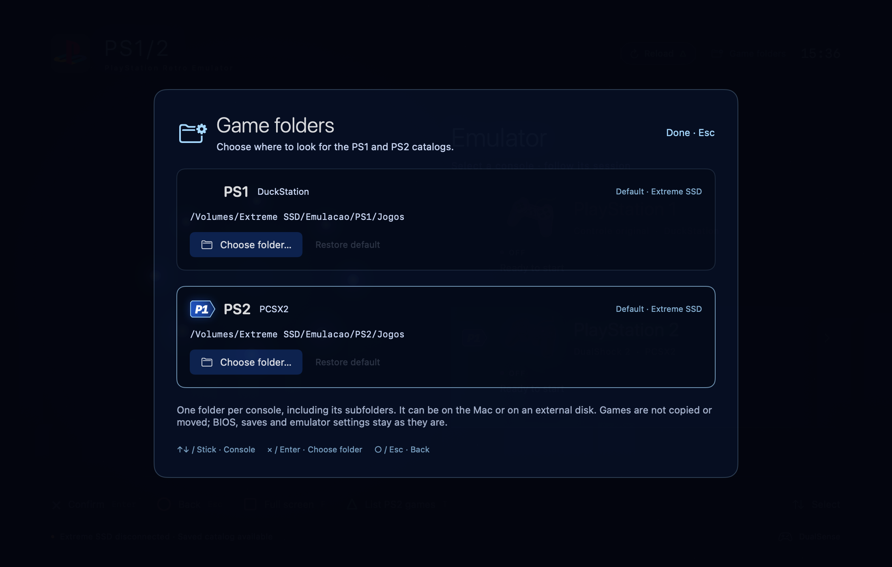

<p align="center">
  
</p>

<h1 align="center">PS1/2</h1>

<p align="center">
  The PlayStation 1 and PlayStation 2 launcher for Mac.<br>
  A console-style menu that opens your games in DuckStation and PCSX2.
</p>

<p align="center">
  <a href="#download-and-install"><strong>Download and install</strong></a>
  &nbsp;·&nbsp;
  <a href="#a-look-at-the-app">See the app</a>
  &nbsp;·&nbsp;
  <a href="#full-guide">Full guide</a>
</p>

<p align="center"><strong>Version 5.0 · build 26</strong> · Apple Silicon Mac · macOS 14 or later</p>

<p align="center">
  
</p>

**PS1/2** is the app you open day to day. It shows both consoles, the preview, the catalog with covers, and the shortcut to play. The game itself runs in [DuckStation](https://www.duckstation.org/) (PS1) and [PCSX2](https://pcsx2.net/) (PS2). The installer puts the launcher in Applications and downloads those official emulators if they are not already on the Mac.

You bring the games and the BIOS. They stay in the folder you choose, on the Mac or on an external disk.

## Novidades da versão 5.0

O fluxo principal agora é **console → biblioteca → jogar → voltar à biblioteca**. PS1 e PS2 continuam usando DuckStation e PCSX2; o jogo não roda dentro da janela da central.

- **Identidade por console:** PS1 em grafite com geometria e detalhes nas cores clássicas; PS2 em azul profundo com torres e círculos. Biblioteca e avisos acompanham o console selecionado. Os fundos vetoriais são locais e pausam quando a central não está ativa.
- **Jogar e voltar:** X/Enter no console abre sua biblioteca. No jogo, inicia uma sessão em tela cheia. “Voltar ao jogo” foca a sessão já aberta sem repetir o boot. Ao encerrar uma sessão iniciada pela central, ela recupera a seleção; só traz sua janela à frente quando isso não interrompe outro app.
- **Sua biblioteca:** Todos, Favoritos, Recentes, busca por nome e capas em tamanho Confortável ou Compacto. Filtro, busca, densidade e última seleção ficam salvos por console **e pasta de jogos**. Recentes indica jogos identificados pelo monitor após abertura pela central, não progresso, save state ou garantia de compatibilidade.
- **Experiência:** inicialização Completa por padrão, Curta (até 1,4 segundo) ou Desligada. X/Enter pula a animação; ○/Esc cancela antes da abertura. Sons originais de navegação são opcionais e começam desligados, com volume independente do jogo. Movimento reduzido respeita o macOS e pode ser ativado também na central.
- **Opções sem sair:** S abre o menu de sessão; Options faz isso na tela de consoles. Nele ficam voltar ao jogo, desligar normalmente, abrir o emulador avulso, Experiência e pastas. Na biblioteca, Options continua abrindo as pastas virtuais; use S ou o botão Sessão para o menu de sessão.
- **Cache primeiro:** a última lista aparece enquanto uma atualização automática procura novidades em segundo plano. Reentradas em menos de 30 segundos não repetem a varredura; Atualizar/R/△/R2+L2 permitem atualizar explicitamente. Um jogo já listado não precisa esperar o término da varredura para ser aberto.
- **Instalação guiada:** `Instalar.command` abre um assistente nativo, com visual inspirado no PS2, verificação do Mac, escolha do destino, etapas de progresso e botões para abrir a central e os emuladores ao terminar. Ele baixa apenas os emuladores oficiais que estiverem faltando.

A central não força o encerramento de emuladores, não troca um jogo já carregado por outro, não altera saves e não baixa jogos ou BIOS. Busca por texto e o seletor nativo de pastas usam teclado/mouse; os filtros, favoritos, densidade, pastas virtuais, avisos e menus podem ser operados pelo controle.

## A look at the app

The menu above illustrates the home screen. PlayStation 2 is selected, the preview plays without opening the emulator, and the bar at the bottom shows keyboard and controller. These screenshots show the earlier layout; version 5.0 adds the console-specific themes and controls described above.

<table>
  <tr>
    <td width="50%" align="center">
      
    </td>
    <td width="50%" align="center">
      
    </td>
  </tr>
  <tr>
    <td align="center"><strong>Catalog</strong><br>Covers, game name and the play action. Mouse, keyboard or controller.</td>
    <td align="center"><strong>Game folders</strong><br>One folder per console. It can be on the Mac or on an external disk.</td>
  </tr>
</table>

The three covers are a sample included in the project, so the catalog can look like this. The games themselves remain yours.

## Download and install

### Comece aqui — sem precisar saber programar

Você precisa de um **Mac Apple Silicon (M1 ou mais novo), macOS 14 ou mais novo e internet para a instalação**. Este repositório é privado: sua conta do GitHub precisa ter acesso.

1. No GitHub, clique em **Code → Download ZIP** e descompacte o arquivo no Finder.
2. Abra a pasta extraída e dê dois cliques em **Instalar.command**. Não mova esse arquivo para fora da pasta do projeto.
3. Na primeira vez, se faltarem as ferramentas de compilação da Apple, o Terminal explica o motivo e oferece abrir o instalador oficial. Confirme somente se concordar, conclua a instalação do macOS e volte ao Terminal para continuar. Não precisa instalar Homebrew nem o Xcode completo.
4. Na janela **PS1/2 · Instalação**, confira a verificação do Mac e o destino (normalmente **Aplicativos / Applications**). Clique em **Instalar** e acompanhe as etapas. O assistente compila e instala a central, baixa **DuckStation para PS1** e **PCSX2 para PS2** se faltarem, e verifica os downloads.
5. Na tela de conclusão, use os botões para abrir os emuladores e terminar a primeira configuração. Depois abra a central, escolha as **Pastas de jogos**, selecione o console e pressione **Enter / ×** para entrar na biblioteca.

**O que não vem junto:** jogos, BIOS e saves. Você precisa fornecer seus próprios arquivos autorizados, configurar a BIOS e o controle em cada emulador e testar um jogo. Se o macOS pedir Rosetta ou mostrar um aviso de segurança, leia e confirme pessoalmente — o assistente não aceita licenças nem contorna proteções. O visual é inspirado nos consoles; não é um sistema operacional da Sony.

**Já tem DuckStation ou PCSX2?** Eles são mantidos. Seus jogos, BIOS, saves, configurações e SSD não são alterados. Para atualizar a central, feche **PS1/2** e execute o instalador novamente; a versão anterior fica em uma pasta de backup indicada no registro.

**Prefere clonar pelo Terminal?** Com Git instalado:

```bash
git clone https://github.com/rafaelferreiram/ps1-2-emulator.git
cd ps1-2-emulator
bash Instalar.command
```

Se o duplo clique não executar o arquivo, abra o Terminal na pasta extraída e use `bash Instalar.command`. Para uma instalação somente por texto, use `bash install.sh`. Para apenas verificar os requisitos, sem baixar, compilar ou instalar nada, use `bash install.sh --check`. Veja as opções e a solução de problemas no [guia completo](#full-guide).

## In short

- PS1 and PS2 menu, with an animated preview that does not start the emulator.
- Catalog with covers, using the mouse, the keyboard or the controller.
- Console-specific themes, optional original interface sounds, favorites, recent games, search and comfortable/compact covers.
- A separate folder for each console, on the Mac or on an external disk.
- The window follows the screen: on a MacBook and on another monitor, maximizing fills the available area.
- The Dock icon uses the current logo, with the rounded macOS shape, and stays visible after you quit the app.

| Action | Keyboard | Controller |
|---|---|---|
| Choose a console or game | Arrows | D-pad or left stick |
| Enter a console's library / play the selected game | Enter | Cross |
| Back | Esc | Circle |
| Full screen | F | Square |
| See the games from the console menu | T, or Enter | Triangle, or Cross |
| Reload games and covers | R, or Atualizar | R2 + L2, or Triangle inside the catalog |
| A–Z or Z–A order | A or Z, in the catalog | L1 or R1 |
| Filters, favorite, density and library options | ↑ at the top of the library, then ←→ and Enter | ↑ at the top of the library, then ←→ and Cross. ↓ returns to the games |
| Catalog folders | P. C collapses the marked game's folder | Options opens. ↑↓ chooses the folder, ←→ the action, Cross confirms, Circle closes |
| Session menu and experience settings | S, then choose an option | Options on the console menu; Sessão or Experiência in the library toolbar |
| Skip startup / cancel startup | Enter / Esc | Cross / Circle |

---

## Full guide

The repository is named `ps1-2-emulator`. The app is named **PS1/2** and the installed file is `PS1-2.app`, because `/` is a folder separator on macOS. Current version: **5.0, build 26**.

## Start here: clone, install and open

O caminho recomendado é o assistente gráfico, aberto por **Instalar.command**. Ele usa o mesmo instalador verificável da linha de comando, mas organiza as ações em telas com visual azul inspirado no PS2. A interface usa mouse/teclado e não exige que um controle já esteja configurado.

Em um **Mac Apple Silicon com macOS 14 ou mais novo**, você também pode clonar pelo Terminal. O repositório é privado: sua conta precisa ter acesso.

```bash
git clone https://github.com/rafaelferreiram/ps1-2-emulator.git
cd ps1-2-emulator
bash Instalar.command
```

**Já clonou?** Atualize sua cópia, entre na pasta `ps1-2-emulator` e execute apenas `bash Instalar.command`, ou dê dois cliques nele no Finder. Feche a central instalada antes de substituí-la.

**Sem Git:** use **Code → Download ZIP** no GitHub, extraia toda a pasta e abra **Instalar.command**. O assistente não depende de uma pasta `.git` e não baixa uma cópia dos seus jogos ou configurações de outro Mac.

Antes de abrir a janela gráfica, o script verifica as ferramentas da Apple usadas para compilar o projeto. Se faltarem, explica a necessidade e oferece abrir `xcode-select --install` **somente com sua confirmação**. A instalação e os termos são da Apple. Depois que ela terminar, volte ao Terminal e continue. Essa primeira etapa pode levar mais tempo e usar vários GB, conforme o pacote da Apple; não é o tamanho da central nem dos jogos. Se as ferramentas exigirem atenção adicional, siga o erro informado; o script não aceita licenças por você.

Na janela, o assistente faz uma **verificação sem alterações**, permite escolher o destino e só inicia a instalação depois de **Instalar**. Mostra progresso por etapas e um registro de diagnóstico que pode ser copiado. Se você fechar após uma falha, o Terminal indica o arquivo temporário `setup-session.log` com os detalhes; falhas de compilação ficam em `setup-build.log`. Sem permissão para `/Applications`, escolha outra pasta existente e gravável; veja [instalar na sua pasta pessoal](#install-without-write-permission-for-applications). Durante a instalação, aguarde a conclusão antes de fechar a janela; o assistente evita interromper a substituição dos apps.

Ele instala a central e baixa **somente DuckStation e PCSX2 que não estiverem instalados**. Não usa Homebrew ou `sudo`, não reinicia o Mac e não abre apps automaticamente. Ao terminar:

1. Use **Abrir DuckStation** e **Abrir PCSX2** para configurar BIOS, biblioteca e controle. Se o macOS pedir Rosetta para algum pacote Intel, a confirmação continua sendo sua.
2. Teste um jogo diretamente em cada emulador. A central não configura BIOS nem controles dos emuladores automaticamente.
3. Use **Abrir PS1/2**, abra **Pastas de jogos** (ou **⌘,**) e escolha a pasta de PS1 e a de PS2, no Mac ou em um disco externo. Entre na biblioteca com **Enter / ×** e confirme o jogo para abrir. **T / △** abre a biblioteca no menu e atualiza a lista dentro dela. Veja [Libraries and covers](#libraries-and-covers).

**On another machine:** cloning or downloading the repository does not copy the catalog, cached covers, games, BIOS, saves or personal settings. You do not edit code to choose the library. The launcher opens without the SSD, but a new machine has an offline catalog only after a first load with the folder available. Besides the games, you provide the BIOS and finish the emulators' first setup. The installer does not skip that step.

## Features

- PS1/PS2 menu, matching controls and the PlayStation logo.
- **P1** (Player 1) marker on the preselected console, following the mouse, keyboard and stick. It is only a visual cursor and does not change the controller port in the emulators. Local vector drawing, with no new images, fonts or downloads.
- Animated preview of the preselected console: a looping GIF, with no sound and **without starting the emulator**. It follows the mouse, keyboard and controller, and continues when the pointer leaves the card. The preview pauses when the launcher loses focus and respects macOS Reduce Motion.
- Optional full or short startup GIF before a new emulator launch, skippable with Cross/Enter and cancellable with Circle/Esc. Returning to an already open session skips the GIF.
- A themed catalog per console, front covers, favorites, recent games, search and two cover densities. The **Atualizar** button, **R** and **R2 + L2** reload games and covers. ↑ at the top reaches the toolbar, ←→ chooses an action, Cross confirms and ↓ returns to the library.
- Local browsing preferences remember the selected game or folder header, filter, query and density separately for each console and library path. The selected item is brought into view again; an exact pixel scroll position is not stored. Recent games are launcher-observed sessions, not save-state shortcuts.
- Optional original navigation/confirm/back sounds, synthesized locally with no downloaded recordings or extra dependencies. They default to off, have independent volume and stop when the launcher becomes inactive. Background effects pause while hidden and respect reduced motion.
- Virtual folders, such as Football or Fighting, only group the list. The files stay where they are. Each group opens and closes on the same screen. Without folders, the catalog is one list.
- **Pastas de jogos / Local dos jogos**: an independent library per console, local or external, saved on this Mac. The original SSD stays the default and can be restored without moving files.
- A local cache of the catalog and thumbnails, shared with the loaded game's cover, to avoid rereading the SSD.
- Saved PS1 and PS2 catalogs restored at launch, including without the SSD, and a console-style notice when you try to play offline. The subtitle is “Playstation Retro Emulator”, without a “MAIN MENU” label.
- On/off indicator, time since the emulator opened, and the loaded game when it can be identified.
- Cover thumbnail beside the loaded game on the main menu: 36 px tall, keeping each console's aspect ratio. It uses the same covers as the catalog. If there is no safe match, it shows a disc icon. The lookup runs in the background when the game changes, without rereading the library every second.
- A normal request to quit the emulator, with confirmation. It does not force the app to close.
- New game sessions request full screen and normal batch exit. Only a game process started by this launcher is tracked for automatic return, using both PID and launch date; separately opened emulators are not adopted.
- The interface follows the size of the window and of the screen it is on. On a 14-inch MacBook and on other monitors, maximizing or using full screen enlarges the menu, the preview and the catalog to fill the available area.
- The Dock icon uses the current logo, with the rounded macOS shape, and stays after you quit the launcher. Installation registers only the installed copy; it does not clear the global icon cache, restart the Dock or unregister other apps.

## Launcher requirements

| Dependency | Why it is needed |
|---|---|
| Apple Silicon Mac — M1 or later | The script compiles for `arm64`. Intel is not a target of this build. |
| macOS 14 or later | Minimum set in `Info.plist` and in the compiler. |
| Xcode Command Line Tools | Provides `swiftc`, the macOS SDK and the build tools. |
| Git (optional) | To clone the repository. Not needed when using Download ZIP. Usually included with the Command Line Tools. |
| DuckStation and PCSX2 | External apps that run the games. |
| BIOS and images of your games | Configure them in the emulators, following their official documentation. |

It does not use Node.js, npm, Python, Homebrew, CocoaPods or external Swift packages. AppKit, SwiftUI, Foundation, Combine, GameController, ImageIO and CryptoKit are system frameworks. `build.sh` also uses macOS tools: `sips`, `ditto`, `xattr`, `codesign` and `plutil`.

The code was compiled and tested with Swift 6.4 on Apple Silicon. The declared minimum is macOS 14. Not every macOS or SDK version has been tested.

## Detailed installation

### 1. Prepare the environment

`Instalar.command` guides this step when needed. To prepare manually, if you do not have the developer tools yet:

```bash
xcode-select --install
```

Finish the install on macOS. Then check:

```bash
xcode-select -p
xcrun --find swiftc
xcrun swiftc --version
git --version
```

Reference: [installing the Command Line Tools from Apple](https://developer.apple.com/documentation/xcode/installing-the-command-line-tools).

### 2. Clone the private repository

You need to be signed in to GitHub with an account that has access. HTTPS example:

```bash
mkdir -p /Users/"$(whoami)"/Workspace/Personal
cd /Users/"$(whoami)"/Workspace/Personal
git clone https://github.com/rafaelferreiram/ps1-2-emulator.git
cd ps1-2-emulator
```

You can also use SSH if your key is already set up. Do not put tokens or passwords in the command, in the code or in the repository. The suggested local folder is `~/Workspace/Personal/ps1-2-emulator`.

### 3. Run the installer

Recommended, from the repository root (or double-click in Finder):

```bash
bash Instalar.command
```

This prepares and opens the native setup window. No emulator is downloaded or app replaced until you click **Instalar**. The first compiler setup, if needed, is handled through Apple's installer with your permission. The window shows progress by stage, not a promised percentage or download ETA.

For the text-only installer:

```bash
bash install.sh
```

The installer checks macOS, architecture and the Command Line Tools, shows the plan and asks for confirmation. It then builds the launcher with `build.sh` and installs it in `/Applications`. If the emulators are missing, it looks up the official releases of [DuckStation](https://github.com/stenzek/duckstation/releases/tag/latest) and [PCSX2](https://github.com/PCSX2/pcsx2/releases/latest), downloads the macOS packages and installs them in the same destination. For PCSX2 it uses the stable release, not a prerelease or Nightly.

Before installing a download, it checks the **SHA-256 reported by the official GitHub API**, the bundle identity and the signature. If the check fails or the required hash is not available, that install stops. There is no option to skip those checks. That does not replace macOS security warnings or the first launch.

The signature check confirms the app's integrity. It does not mean notarization or approval by Apple. DuckStation may use an ad hoc signature, and the launcher is built with a local ad hoc signature. Downloaded emulators keep quarantine so macOS can check them on first open.

- Existing DuckStation and PCSX2 apps in `/Applications`, `~/Applications` or the chosen destination are kept when they have the expected app name and bundle ID. The installer **does not update or overwrite them**. An install with another name may need a manual check.
- If the launcher is already installed, quit it before continuing. The previous version is stored in a hidden `.ps12-backup.*` folder at the destination. The backup path is printed in the installation log (Terminal or the wizard's details). It is not a backup of your saves.
- To return to the previous version, quit the launcher and move the `PS1-2.app` from the printed backup path back to the install destination. The emulators and saves do not need to be replaced.
- Games, BIOS, saves, memory cards, emulator settings and the SSD are not modified. You can run it again to reinstall the launcher and fill in missing dependencies.
- No app is opened automatically. There is no reboot, no automatic acceptance of licenses or Rosetta, no Homebrew install and no automatic removal of quarantine from downloads.
- On failure, the installation log shows the error and temporary diagnosis folder. On success, temporary downloads are removed. Launcher backups stay at the destination. If a copy fails for lack of space or permission, apps that were already installed successfully may remain: fix the cause and try again. Copying the log can include local paths; review it before sharing.

Available options:

| Command | What it does |
|---|---|
| `bash Instalar.command` | Opens the guided native installer. This is the recommended startup. |
| `bash install.sh` | Builds and installs the launcher and downloads missing emulators, after confirmation. |
| `bash install.sh --check` | Diagnosis without building, downloading or changing files. |
| `bash install.sh --no-emulators` | Builds and installs only the launcher. It does not download emulators. |
| `bash install.sh --destination "$HOME/Applications"` | Uses the home Applications folder, which must already exist. |
| `bash install.sh --yes` | Skips the script's confirmation. It does not accept licenses or macOS warnings. |

Arguments passed to `Instalar.command` go to the text installer: for example, `bash Instalar.command --check` stays a read-only check and does not compile the wizard or install Apple's tools. To select the install folder in the graphical version, open it without arguments and use its destination picker.

#### Install without write permission for Applications

Do not run the installer with `sudo`. Create an **Applications** folder inside your home folder using Finder, then select it with the wizard's destination picker. The equivalent text commands are:

```bash
mkdir -p "$HOME/Applications"
bash install.sh --destination "$HOME/Applications"
open "$HOME/Applications/PS1-2.app"
```

Do not move the repository folder inside `PS1-2.app`. The installed app contains the executable and the resources needed to open the launcher. The library and the emulators stay outside it.

### 4. Open and prepare the emulators

For the default destination, open **Applications → PS1-2**, or run:

```bash
open /Applications/PS1-2.app
```

If you want, keep the icon in the Dock. If an old pinned shortcut still shows another copy, remove just that shortcut from the Dock and pin the installed app from Applications again; no global cache cleanup is needed. See [the emulator guide](docs/EMULADORES.md) to set up BIOS, libraries, the controller and the first launch. At the default destination, the emulators are at:

```text
/Applications/DuckStation.app
/Applications/PCSX2.app
```

Try a game directly in the emulator first. The launcher does not configure BIOS, renderer, memory or controller mapping automatically.

### Build manually, without installing

For development or to inspect the bundle:

```bash
bash build.sh
```

The script generates the icon, copies the resources, compiles the native executable, applies a **local ad hoc signature** and validates the bundle. It does not download emulators or install the launcher in Applications. When it finishes, it prints a path similar to `/private/tmp/ps12-build.ABC123/PS1-2.app`. Use the real printed path to open or copy the app yourself. An Apple Developer certificate is not required for the local build. An ad hoc signature is not Apple notarization.

The default build uses a local temporary folder to avoid Finder or iCloud metadata that can interfere with signing. `cache/`, `MakeIcon` and `AppIcon.iconset/` are generated locally and ignored by Git. The app is not run with `swift run`: this project builds a macOS bundle directly with `build.sh`.

## Libraries and covers

The default folders remain these, outside the repository:

```text
/Volumes/Extreme SSD/Emulacao/
├── PS1/Jogos/
└── PS2/Jogos/
```

### Choose another folder, without editing code

1. Open **Pastas de jogos** through the session menu, or **Local dos jogos** in the catalog. The app menu also has the folder command, with the shortcut **⌘,**.
2. On the **PS1** or **PS2** card, click **Escolher pasta…**. Select any readable folder on internal storage or on an external disk and confirm the picker. The file picker is the native macOS one. Use the mouse or keyboard in it.
3. The launcher saves the choice and does a full load **of that console only**. It accepts one folder per console, including subfolders. It does not search the whole Mac. Choose the folder dedicated to the games, not the root of a disk.
4. Click **Concluído** and enter the console's catalog with **Enter / ×**. After adding games or covers, press **T / △** inside it to reload explicitly.

Cancelling the picker leaves everything as it was. **Restaurar padrão** returns to the original `Extreme SSD` folder and tries to recover its saved catalog, including while the disk is disconnected. If needed, reload with **T / △** when it is connected.

The choices stay in the app's local preferences, separate for PS1 and PS2, and survive quitting, reopening and updating the app. The launcher does not move or copy games and does not change BIOS, saves, memory cards or emulator settings. If you want the same library listed inside DuckStation or PCSX2, set the folder in their preferences too. `--destination` on the installer only changes where the apps are installed.

Official covers come from `~/Library/Application Support/DuckStation/covers` and `~/Library/Application Support/PCSX2/covers`, matched by the disc serial. An image in the game folder is used when the catalog does not have an official cover that belongs only to that game: PNG, JPG, JPEG or WebP. It can be named `capa`, `cover` or `front`, or it can be the only image beside the disc. If the game is inside a `GAME` subfolder, the image can sit in the folder above. Two discs that share a serial do not share the same art: the official cover stays with the game that matches the original name, and the other uses the image in its own folder.

On PS2, the cover shown is the front, in portrait. A single unfolded case image, with back, spine and front, is shown as the front only. If a `capa` file is also there, that file is the cover the catalog uses. Three front covers included in `assets/Covers/PS2` keep the presentation of those titles consistent.

The listing does not copy games. ZIP, RAR and 7z do not appear. Valid CUE/BIN sets are grouped, without listing each track as a game. A folder of BIN tracks with no CUE appears as one game: track 1. Later tracks stay part of the same disc and do not become separate games. Incomplete descriptors are left out, with a warning.

If macOS asks for access to the external volume, choose **Allow** to finish a full load or to open a game. While that prompt is waiting, a loading or updating message may appear. No permission is bypassed automatically.

## Controls

| Action | Keyboard | Compatible controller |
|---|---|---|
| Select a console or game | Arrows | D-pad or left stick |
| Enter the console library / play the selected game | Enter | Cross |
| Back / cancel the launch | Esc | Circle |
| Full screen / window | F | Square |
| List games from the console menu | T, or Enter | Triangle, or Cross |
| Reload games and covers | R, or Atualizar | R2 + L2. Inside the catalog, Triangle also reloads |
| Catalog order | A for A–Z, Z for Z–A | L1 for A–Z, R1 for Z–A |
| Filters, favorite, density and library options | ↑ at the top of the library, then ←→ and Enter. ↓ returns to the library | ↑ at the top of the library, then ←→ and Cross. ↓ returns to the library. L1, R1, Options and △ remain shortcuts |
| Catalog folders | P opens. C collapses or shows the marked game's folder | Options opens the panel. ↑↓ chooses the folder, ←→ the action, Cross confirms, Circle closes |
| Open or collapse a virtual folder | Select its header, then Enter | Select its header, then Cross; collapsed headers remain navigable |
| Search by game name | Click Buscar jogos and type; Enter finishes editing, Esc leaves the field | No on-screen keyboard; Limpar busca is available through the toolbar |
| Session menu | S, or Sessão | Options on the console menu; select Sessão in the catalog toolbar |
| Boot, sound and motion preferences | Session menu → Experiência, or the catalog toolbar | Same menus; ↑↓ selects, ←→ changes, Cross confirms, Circle closes |
| Skip startup / cancel startup | Enter / Esc | Cross / Circle |
| Set game folders | ⌘, or the session/library option | Open Local dos jogos or the session option, then the D-pad or stick chooses PS1/PS2, Cross opens the picker and Circle goes back |
| Quit the launcher | ⌘Q | — |

With the mouse, hovering PS1 or PS2 preselects the console. Clicking enters that console's library; it no longer starts the emulator immediately. The preview of the preselected console continues even without hover and also follows the keyboard or controller arrows. The preview GIF is silent, local and does not download anything. Optional interface sounds are a separate preference. Controller mapping inside the games remains each emulator's job.

The left stick selects in four directions. On the menu, each tilt changes the console once: return it to center before repeating in the same direction. In the catalog, left and right move between items and up and down move one row. Collapsible folder headers are navigation rows too, so empty or collapsed groups can be reopened by controller. Holding repeats after 450 ms, every 140 ms. The dead zone and diagonal settling avoid moves from small wobble. After changing screens, using a button or returning from another app, return the stick to center to arm it again. The right stick does not navigate.

A–Z and Z–A reorder the same list; **Recentes** keeps most recently opened first. On the controller, ↑ at the top reaches the toolbar: ←→ changes the option, Cross confirms and ↓ returns to the library. Favorites, filters, clearing the search and density are available there. L1, R1, OPTIONS and △ remain shortcuts. **Pastas** creates groups such as Football or Fighting and only organizes the catalog: no file is moved. Without folders, the screen stays one list. Each group can collapse and reopen, and anything left out appears in the ungrouped library.

The **Atualizar** action reloads the list and the covers of the console in focus. The **R** key and **R2 + L2** do the same, on the menu or in the catalog. Inside the catalog, **T / △** also reloads. R2 and L2 must be held together. Releasing only one trigger does not fire it again. Explicit updates bypass the automatic 30-second throttle, but concurrent requests are coalesced rather than starting parallel scans of the same library.

Cross, Circle, Square, Triangle, R2, L2, the D-pad and the stick act only while the launcher is focused. Controller mapping inside the games remains each emulator's job.

## Sessions and limits

- “On” means the emulator app is open. It does not guarantee that a game is running.
- The counter measures time since the emulator opened, including pauses and time spent in its menu.
- “Game loaded” is inferred from disc images the process has open. The launcher does not tell playing from paused and does not use old logs to guess.
- Images outside the library, files held entirely in memory, or denied access can prevent identification.
- New game sessions start the official app with `-fullscreen -batch -- <game path>` for either emulator. Full-screen behavior and normal game shutdown still belong to that emulator. Batch mode requests exit after the game shuts down; it does not bypass save confirmations. Separately opened emulator settings are not rewritten.
- Switching games while another session is loaded is blocked. Finish the session in the emulator itself. **Voltar ao jogo** focuses an existing session immediately, without boot animation or a new game request.
- If either emulator is already open with no identified game, a themed confirmation offers a normal quit and restart with the chosen game. Since identification has limits, cancel if that window is doing something you want to keep. The launcher never force-quits and stops if normal termination is refused or still waiting for confirmation.
- Automatic return tracks only game processes started by this launcher, matching both PID and launch date. After that exact process exits, the selected item is restored. The launcher only brings itself forward if the emulator was the last active app or the launcher is already active; it does not steal focus from another app or adopt independently opened sessions. The selection is still subject to the current library and filter.
- Recent games are recorded when the monitor identifies the requested disc in the matching launched process. A successful open request alone does not prove the game booted. This is local launch history, not playtime, game progress, a compatibility test or an automatic save/load feature.
- Quitting the launcher does not save games and does not quit the emulators automatically.

### Launch troubleshooting: DuckStation leaves full screen

DuckStation's automatic update dialog can deliberately leave full screen, even after a correct `-fullscreen` launch. Dismiss the dialog, or complete the update yourself, then use DuckStation's **Fullscreen** command or its configured fullscreen hotkey. The launcher requests full screen but cannot guarantee that later emulator dialogs will preserve it. It does not suppress updates or change the update preference. In the verified `c66b2694d` revision, `-nogui` does not skip the startup update check either. See the upstream [updater window behavior](https://github.com/stenzek/duckstation/blob/c66b2694d/src/duckstation-qt/mainwindow.cpp#L3377-L3396) and [startup sequence](https://github.com/stenzek/duckstation/blob/c66b2694d/src/duckstation-qt/qthost.cpp#L3435-L3448).

## Game and cover cache

The cache lives in `~/Library/Caches/local.rafael.centraldejogos/`, on the Mac's internal storage. It stores only the game index and cover thumbnails. It does not copy ISOs, BINs, BIOS or saves and does not use extra space on the games SSD.

- `Catalog/`: saves the **last successful full load**, with titles, paths, covers and the CUE/CCD/M3U disc grouping. With the disk disconnected, opening the catalog reuses that index, from memory or from the local disk, without scanning the library. It keeps up to eight indexes in memory and up to eight files / 16 MiB on disk (4 MiB maximum per file).
- When the launcher starts, both catalogs are restored from the local cache, even without the SSD. If there is no saved cache yet, that restore does not scan. You need to connect the SSD and open or reload the catalog once. Do not delete the cache if you want to keep offline browsing.
- Entering the catalog first uses its saved index and, with the folder available, schedules a **background full scan**, throttled to avoid another automatic scan within 30 seconds of the previous attempt. This is not an incremental filesystem watcher or a timer that scans every 30 seconds. A first uncached load and choosing a different folder still need a scan. **Atualizar**, **R**, **R2 + L2** or **△ / T** inside the catalog bypass the throttle. Existing games stay selectable and playable during the scan; launch validates only the chosen game. Merely focusing the app or reconnecting the disk does not start a scan. Failed updates retain the saved list with a warning; failed automatic attempts are throttled too, while an explicit update can retry immediately.
- The index is separate per **console and library path**. Changing folders removes the previous list from the screen immediately. An old task cannot put it back. Returning to the default library can recover its cache, within the limits above. No choice deletes game or cover files.
- `Thumbnails/`: catalog thumbnails use 320, 480, 640 or 1024 px buckets according to their rendered size and display scale; the menu has a 108 px request. RAM and disk hits do not consult the original cover. Visible cards request their artwork on demand; low-priority batches progressively warm offline covers instead of eagerly decoding every size. Optional warming pauses while a game is running and the launcher is inactive. If a suitable thumbnail does not exist or was evicted, the cache tries to read only that cover, without rereading the games. Without access to it, a placeholder appears. An unvisited cover is not guaranteed to be available offline before warming finishes, and cache limits can evict older covers.
- The cover cache budget is 32 MiB of images kept in memory and 64 MiB / 256 files on disk. Visible views may keep extra images. That budget is not the app's total memory use. Automatic cleanup removes only files from this cache.
- With the external disk disconnected, you can browse the last list and the covers already saved. **When you choose “Jogar”**, the launcher validates the selected files. If the volume is disconnected, it shows a themed notice with the volume name and the game title, without starting the emulator. Cross/Enter or Circle/Esc closes the notice and keeps the catalog. After reconnecting, choose the game again: there is no automatic launch. Games in a local folder do not depend on another console's SSD. The cache does not contain the games. Removed files or files without permission get their own message.
- Corrupt or unavailable cache files are ignored and recreated. If you need to clear it by hand, quit the launcher and move only that cache folder to the Trash. Never delete the game, BIOS or save folders.

This optimization is for the launcher and the catalog. It does not change speed, FPS, settings, saves or the internal behavior of DuckStation and PCSX2.

## Tests

From the project root:

```bash
bash tests/run-monitor-tests.sh
bash tests/run-catalog-tests.sh
bash tests/run-catalog-organization-tests.sh
bash tests/run-hover-animation-tests.sh
bash tests/run-now-playing-tests.sh
bash tests/run-launcher-preview-tests.sh
bash tests/run-controller-input-tests.sh
bash tests/run-launch-check-tests.sh
bash tests/run-cache-tests.sh
bash tests/run-cover-cache-tests.sh
bash tests/run-installer-tests.sh
bash tests/run-bootstrap-tests.sh
bash tests/run-setup-wizard-tests.sh
bash tests/run-library-settings-tests.sh
bash tests/run-responsive-layout-tests.sh
bash tests/run-personal-library-tests.sh
bash tests/run-session-lifecycle-tests.sh
bash tests/run-console-experience-tests.sh
```

These tests use local fixtures and the included GIFs. They do not need to download games or BIOS, and they do not start emulators. The suites cover the session monitor, animations, the catalog, snapshots without a scan, offline browsing, a failed update that keeps the saved list, validation of the chosen game, an exact match between the open disc and the cover (including CUE/CCD/M3U) and six compact thumbnail layouts. The layout test writes a temporary preview with fake data for visual inspection.

The folder and personal-library tests use temporary preferences and directories. They cover persistence, validation, offline restore, console/root isolation, favorites, query/filter behavior, history and late results from earlier loads. Session lifecycle fixtures check process identity and navigation without starting emulators. Experience tests verify preference defaults/persistence, controller adjustment, motion settings and deterministic sound decoding without playing audio. The installer tests use isolated scenarios, without installing real emulators or replacing apps in `/Applications`. `bash install.sh --check` can check your machine's prerequisites before you install.

The setup tests cover literal command arguments, streamed progress markers, UTF-8 output, bounded logs, large combined stdout/stderr, prerequisite failures, retry, explicit installation and an inert preview. They use harmless fixture backends, not real installs. The startup tests exercise prerequisite guidance and command forwarding. On 05/10/2026, a separate download-only check of the production installer passed for the official DuckStation `latest` macOS ZIP and PCSX2 `v2.8.2` stable macOS archive, including SHA-256, bundle identity, signature and quarantine. No emulator was opened or installed by that check. Download contents can change later, so checks remain mandatory on every installation.

Optional, only on a machine with the emulators and SSD set up: a read inventory of the real libraries:

```bash
bash tests/run-catalog-tests.sh --installed --front-covers "$PWD/assets/Covers"
```

That prints game paths in Terminal. Do not share the output if it contains data you do not want to publish. The tests do not prove that every title is playable and do not replace a physical controller test.

To compare a full read, the in-memory cache and the persistent cache against the installed library:

```bash
bash tests/run-cache-benchmark.sh
```

The benchmark does not start emulators or change games. It writes its test cache in a temporary folder, removed when it finishes. Times vary with the SSD, the library and macOS's own cache.

Historical local measurement of **version 4.6**, on 29/09/2026 (**not a version 5.0 benchmark**; catalog lookup, not total interface time; average of five in-memory lookups):

| Library | Full read | In-memory cache | Cache after recreating the loader |
|---|---:|---:|---:|
| PS1, 5 games | 885 ms | 0.3 ms | 1.9 ms |
| PS2, 14 games | 416 ms | 0.5 ms | 2.2 ms |

In that older test, the 19 covers saved at both sizes (38 thumbnails) used 3.3 MB in the test disk cache and about 6.7 MB decoded in the memory cache. In-memory lookups and reopening from the persistent cache made **zero new scans and zero library metadata checks**. Version 5.0's automatic background refresh and variable artwork sizes are a different workload; these figures are not a claim about its launch latency or memory use. No game was copied.

## Layout

```text
PS12.swift                 Menu, windows, state and emulator launch
ResponsiveLayout.swift     Interface scale for the window and the screen
ControllerInput.swift      Controller input
EmulatorMonitor.swift      Process monitor and loaded game
GameCatalog.swift          Library scan and cover selection
CatalogOrganization.swift  A–Z/Z–A order and virtual catalog folders
PersonalLibrary.swift      Per-console/root favorites, recents, selection, query and density
ConsoleExperience.swift    PS1/PS2 themes, preferences, motion and original optional audio
SessionLifecycle.swift     Owned process identity, launch arguments and folder navigation
GameLaunchCheck.swift      Validation of only the chosen game and its disc files
StorageNoticeView.swift    Disconnected-disk notice with a console-inspired look
LibrarySettings.swift      Persistent PS1/PS2 folders and volume metadata
LibrarySettingsView.swift  Panel to choose or restore the libraries
CatalogCache.swift         Last successful full load and lookups that do not scan the SSD
CoverImageCache.swift      Shared thumbnails with RAM and disk limits
GameCatalogView.swift      Catalog interface
NowPlayingGameView.swift   Async thumbnail of the loaded game
StartupAnimation.swift     GIF before the emulator opens
HoverAnimation.swift       Looping decorative preview
MakeIcon.swift             App icon generation
Info.plist                 Bundle identity and version
build.sh                   Compile and local signature
install.sh                 Install the launcher and missing official dependencies
Instalar.command           Finder startup: Apple tools guidance and native setup window
scripts/SetupWizard.swift  PS2-inspired installation, progress and first-launch buttons
scripts/SetupInfo.plist    Identity of the temporary native setup app
scripts/installer-lib.sh   Official downloads, validation and publishing the apps
scripts/MoveApp.swift      Exclusive, safe rename during install
assets/                    Logo, photos, GIFs and three front covers
tests/                     Automated tests
docs/EMULADORES.md         Downloads and first setup
Creditos.txt               Sources and attribution for the visual assets
```

## Credits and use

A personal project, with no official link to Sony, DuckStation or PCSX2. Third-party assets keep their own rights. Keeping the repository private does not change those rights. See [Creditos.txt](Creditos.txt) for the origin of the controllers, logo, GIFs and covers. No open redistribution license was assigned to the third-party assets.

Do not include ROMs, BIOS, saves, credentials, personal backups or emulator builds in this repository. `.gitignore` helps avoid accidental additions, but it does not replace reviewing the files before a commit.
